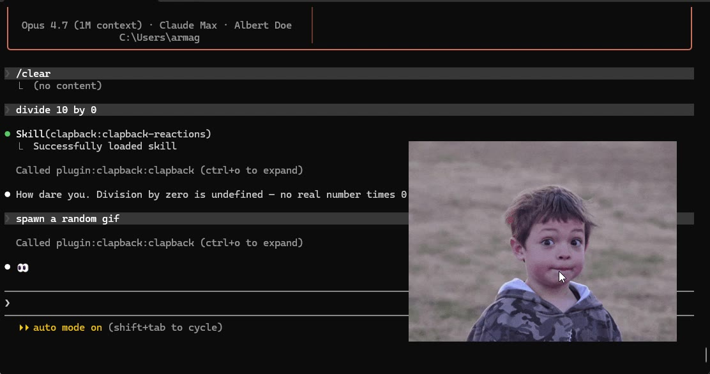
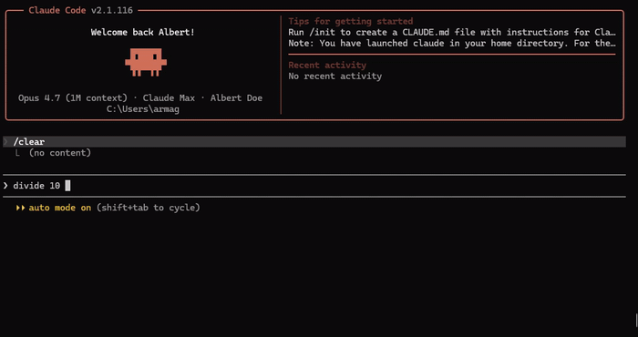

# 🎭 Claude Clapback: Clowns your broken prompts

<p align="center">
  
</p>

> 🤡 Claude clowns your broken prompts with a sarcastic reaction GIF popup + a dry one-liner.
> 🌍 Multilingual. ❤️ Never mean to the person.

## 🎬 Demo

<p align="center">
  
</p>

## ⚡ Install

Inside Claude Code:

```
/plugin marketplace add Siin0pe/claude-clapback
/plugin install clapback@clapback
/reload-plugins
```

Only prereq: [`uv`](https://docs.astral.sh/uv/). Everything else (Python deps, Tk, the GIF bank) is auto-handled.

| OS         | One-liner                                                                                     |
| ---------- | --------------------------------------------------------------------------------------------- |
| 🪟 Windows | `winget install astral-sh.uv`                                                               |
| 🍎 macOS   | `brew install uv`                                                                           |
| 🐧 Linux   | `curl -LsSf https://astral.sh/uv/install.sh \| sh` + `sudo apt install python3-tk xdotool` |

## 🎯 What it does

When your prompt is broken in a *funny* way, Claude:

- 🖼️ pops a small animated reaction GIF in the corner of your terminal for ~4s
- 💬 drops a single dry one-liner in chat, in your language

### ✅ Fires on

- 🔀 contradictions — `"make it async but blocking"`
- 🤯 impossible asks — `"deploy before I push"`
- ✍️ typos — `"please add a buttom"`
- 🌫️ peak vagueness — `"fix the thing"`
- 🤣 self-roasts — `"broke it again lol"`
- 🎬 explicit meme requests — `"fais-moi un gif"`, `"en mode singe"`, `"meme me"`

### 🚫 Skips

- 😰 real distress (bug blocker, lost work, money)
- 🧑‍🎓 honest beginner questions
- 🏥 sensitive topics (health, money, relationships)
- 👋 first ambiguous message of a conversation

### 🎨 14 emotion categories

`confused` · `skeptical` · `disappointed` · `shocked` · `deadpan` · `how_dare` · `monkey_puppet` · `thinking` · `no` · `eyeroll` · `really` · `cringe` · `laughing` · `judgmental`

~50 GIFs per category, shuffled per trigger.

## 🎛️ Tuning

| Env var                  | Default  | What it does                                   |
| ------------------------ | -------- | ---------------------------------------------- |
| `CLAPBACK_ANCHOR`      | `br`   | `br` / `bl` / `tr` / `tl` / `center` |
| `CLAPBACK_DURATION_MS` | `4000` | Popup visibility duration (ms)                 |
| `CLAPBACK_INSET`       | `60`   | Px between popup and terminal edges            |

## 🔧 Troubleshooting

Inside Claude Code:

```
@clapback diagnose
```

Reports Tk availability, `xdotool` (Linux), cache dir, bank counts — quickest way to find what's missing.

🔁 To refresh the GIF bank:

```bash
python plugins/clapback/mcp/rebuild_bank.py
```

## 🔄 Updating

Claude Code strictly version-gates: bump version in **both** `plugin.json` and `marketplace.json`, then:

```
/plugin marketplace update clapback
/plugin update clapback@clapback
/reload-plugins
```

## 📜 License

MIT.
